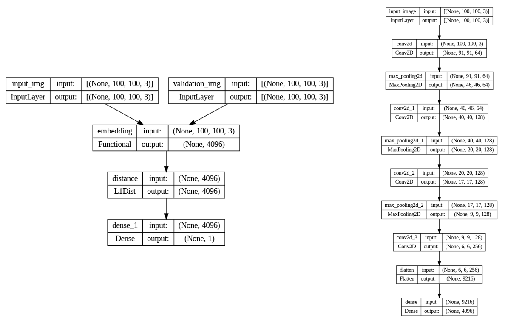
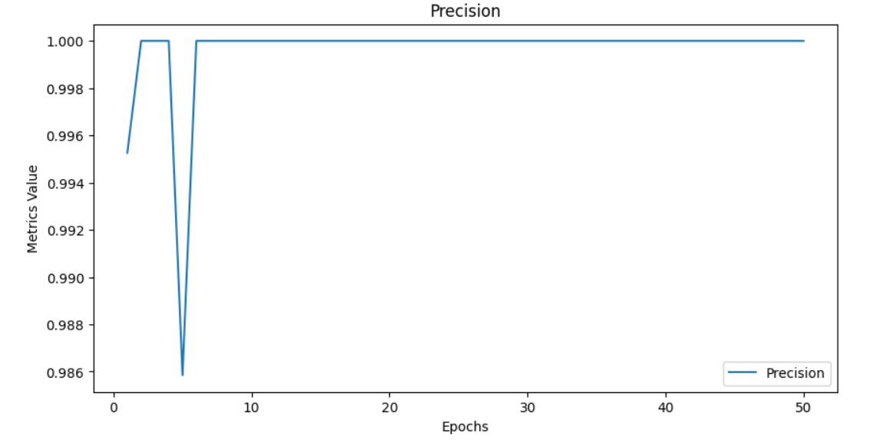
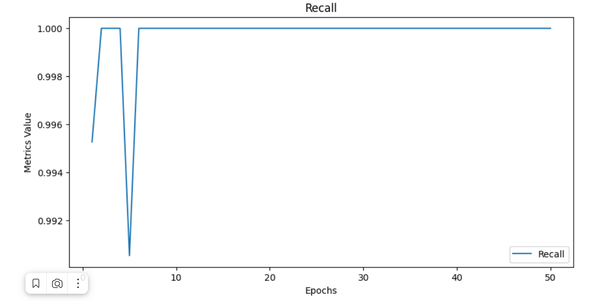

# Facial-Verification

Итоговый проект для сдачи в рамках дисциплины  
**«Распознавание образов»**  
(7 семестр, УГАТУ)

---

# 😊 Система верификации лиц на основе сиамской нейронной сети

## 📖 Описание проекта

Проект представляет собой реализацию системы верификации лиц с помощью сиамской нейронной сети, адаптированной для обучения на ограниченном наборе данных.  
Основная цель — обеспечить высокую точность распознавания и проверки личности при минимальном количестве исходных изображений.

## ✨ Ключевые особенности

- 🤖 ****  
  Две идентичные подсети с общими весами для сравнения изображений.
- 📉 **Малая потребность в данных**  
  Эффективное обучение на нескольких сотнях изображений.
- ⚙️ **Гибкая верификация**  
  Пороги `detection` и `verification` позволяют настраивать чувствительность системы.
- 🛠️ **Инструменты**  
  TensorFlow, Keras, OpenCV, Google Colab.

## 🏗️ Архитектура модели

  

1. 🧩 **Подсети («близнецы»)**  
   Каждая обрабатывает своё входное изображение через сверточные слои для извлечения признаков.  
2. 📏 **Функция сходства**  
   Манхэттенское расстояние между выходными векторами признаков.  
3. 📊 **Классификация**  
   Логистическая регрессия по расстоянию для предсказания вероятности совпадения лиц.

## 📂 Данные

- 🖼️ **Якорные и позитивные изображения**  
  Собственный датасет из 300 изображений одного человека.  
- 🚫 **Негативные изображения**  
  300 изображений из датасета [Labeled Faces in the Wild (LFW)](http://vis-www.cs.umass.edu/lfw/).

## 🏋️ Обучение

- 📈 **Функция потерь**: бинарная кросс-энтропия.  
- 🎯 **Метрики на тренировке**: точность и полнота — 100%.  
- 🧪 **Конечные метрики на тесте**:  
   — 98.87%  
   — 97.77%.

## ✅ Верификация

Для оценки качества работы системы используется логика:
1. 🔍 Вычисление числа пар, прошедших порог `detection` (0.9).  
2. 📐 Рассчет отношения прошедших порог `verification` (0.7) к общему числу валидационных пар.  
3. 🔔 Возврат булевого результата: `true` (верификация пройдена) или `false`.

## 🚀 Перспективы развития

- 🎨 Добавление аугментации данных для повышения устойчивости.  
- 📡 Интеграция с системами реального времени (веб-камеры, мобильные приложения).  
- 🔬 Исследование других функций потерь и метрик сходства.

---

# 📊 Презентация проекта

[📄 Открыть презентацию (PDF)](./presentation.pdf)
